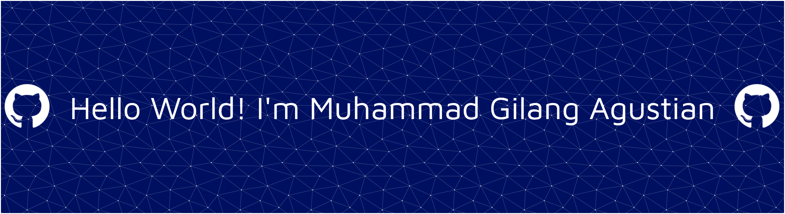

<!-- HEADER -->

  

  

---

### Socials
 [](https://www.tiktok.com/@m.gilangagustian?_r=1&_d=e029f3082d99jc&sec_uid=MS4wLjABAAAA_5yBKNC6hMm0vrbXxy2z4gpRHguWPECkhJVnZTkwp5TSBsfGWCfflira52TPdztU&share_author_id=7082770621968843802&sharer_language=id&source=h5_t&u_code=e14cl9cmljaad8&timestamp=1763193252&user_id=7082770621968843802&sec_user_id=MS4wLjABAAAA_5yBKNC6hMm0vrbXxy2z4gpRHguWPECkhJVnZTkwp5TSBsfGWCfflira52TPdztU&item_author_type=1&utm_source=copy&utm_campaign=client_share&utm_medium=android&share_iid=7572752608025724679&share_link_id=35ab39d3-abb3-43f6-94f5-c6910c150290&share_app_id=1180&ugbiz_name=ACCOUNT&ug_btm=b8727%2Cb7360&social_share_type=5&enable_checksum=1) 

---

### Tech Stack

##### Programming Languages

  
  
  

##### Frameworks & Libraries

  
  
  
  

##### Databases

  

##### Tools & Platforms

  
  
  

---

### Organization & Leadership
| Organisasi | Deskripsi |
|-----------|-----------|
| **OSIS** | Meningkatkan kepemimpinan dan koordinasi untuk menciptakan lingkungan sekolah yang positif. |
| **Paskibra** | Melatih kedisiplinan, kekompakan, dan nasionalisme. |
| **Pramuka** | Membangun karakter, tanggung jawab, dan keterampilan sosial. |

> *“Disiplin, tanggung jawab, dan semangat belajar adalah fondasi menuju masa depan yang lebih baik.”*

---

#### Internship (PKL)
📍 **Politeknik Negeri Bandung**

Fokus utama:
- Front-End & Back-End Development  
- CodeIgniter4 
- Pembuatan sistem web responsif & interaktif  

---

  

---

#### GitHub Stats

  
  

---

#### GitHub Trophies

  

---

#### Activity Graph

  

---

  

<!-- Adaptive banner -->

  

